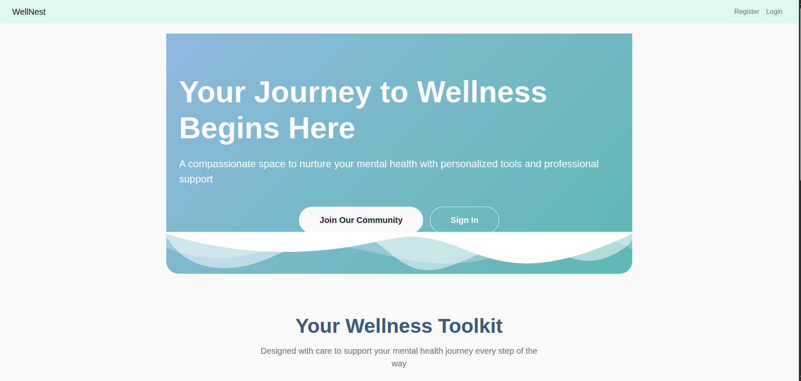
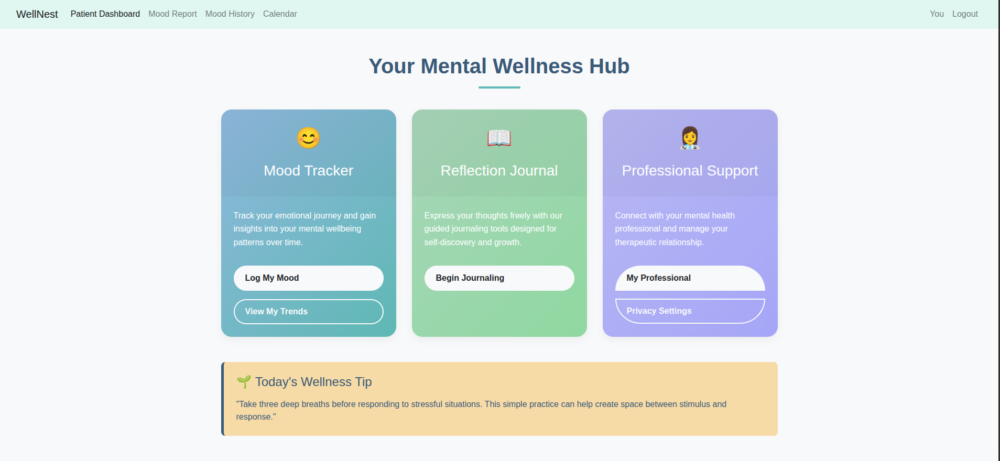
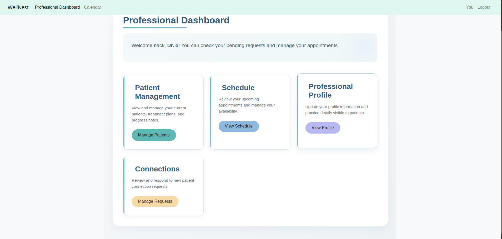

# 🌿 Wellnest
### Accelerating mental health interventions through smart management.

The global shortage of mental health professionals has created a bottleneck in patient care, leading to long wait times and delayed treatment. **Wellnest** addresses this systemic issue by providing a streamlined platform for rapid professional matching and tool-based support. Our goal is to maximize the reach of existing professionals while providing patients with the immediate resources they need to manage their well-being effectively.


---

## 🛠️ System Architecture & Roles

Wellnest is designed as a dual-sided ecosystem to ensure efficiency for both the provider and the seeker.

### 👤 For Patients (Seekers)
* **Dashboard:** Cetralized overview of tools available for use
* **Access to Professionals:** Access to professionals of your choice for diagnosis
* **Self-Service Toolkit:** Immediate access to self help tools such as a journal and mood tracking while awaiting appointments.
* **Professional calendar:** Access to your profesional's calendar to see when they are available for a session
* **Privacy:** Control what your professional is abale to access on your dashboard


### 👨‍⚕️ For Professionals (Providers)
* **Smart Dashboard:** A centralized view of patient history
* **Calendar:** A calendar where they can accept or reject patient bookings and also view awaiting appointments
* **Case Management:** Tools to track patient progress over time using data-driven insights from user-logged moods and activities.
* **Resource Distribution:** Easily share personalized digital "prescriptions" (articles, exercises, or journals) with patients throug notes section in the app.


### Administrators
* **Verify professionals:** Verify professionals on the backend to give thema access to the platform
* **User Management:** Manage users who make use of the platform
---

## 🏗️ Technical Implementation
* **Backend:** Built with Python/Django for robust data handling and security.
* **Real-time Logic:** Utilizes notes for instant messaging
* **Calendar:** Utilizes full calendar.js to implement the calendar
* **Frontend:** Use of Bootstrap and vanilla Js

  ## Getting Started

### Prerequisites

Ensure you have the following software installed on your machine:

- Python 3.x
- Django
- SQLite (or PostgreSQL for production)
- pip (Python package manager)

### Installation

1. **Clone the repository**:
   ```bash
   git clone (https://github.com/Leeshirn/mental-health-management.git)
   cd mental-health-management
   ```
2. Install the dependencies
```bash
pip install -r requirements.txt
```
## Usage
Admin Interface: To access the Django admin interface, go to /admin/ after logging in with the superuser credentials.

Professional Dashboard: Professionals can access their HTML dashboard via the URL /professional_dashboard/.

Patient Dashboard: Patients access their dashboard via the  url /patient_dashboard/

## Code Structure
mental/: Main project directory containing core Django settings.

website/: Contains models, views and urls for managing programs and client data.

manage.py: Django management script for running the server and managing the project.

## Contributing
We welcome contributions to improve the WellNest Health Management System. To contribute:

1. Fork the repository.
2. Create a new branch for your changes.
3. Make your changes and test them.
4. Submit a pull request with a description of your changes.

